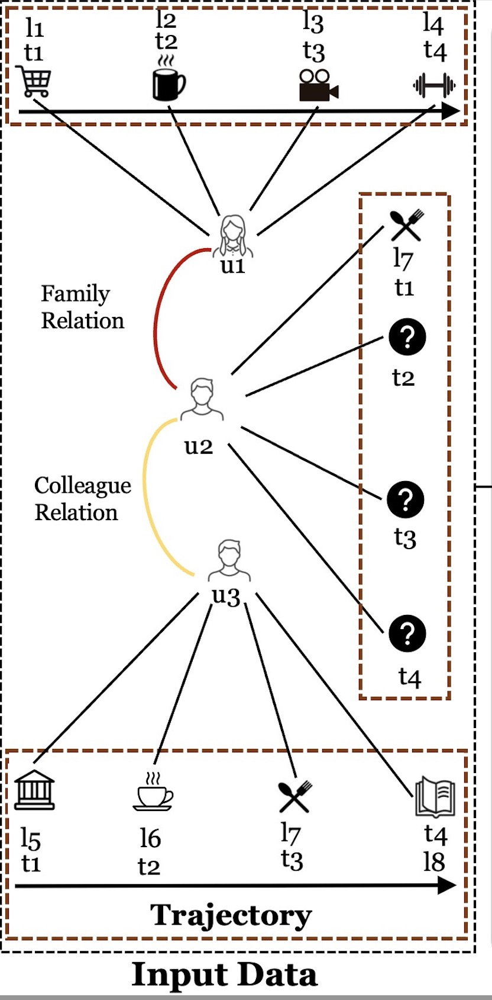
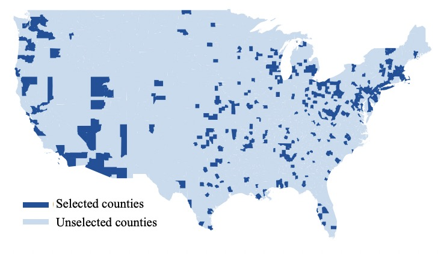



Empower Next POI Recommendation with Multi-Relation Modeling   
======
__Zheng Huang__, Jing Ma, Natasha Zhang Foutz and Jundong Li (Sep 2020 - Jul 2021, Submitted)

  *  Studied on Points of Interests (POI) recommendation by capturing the influence of multiple relations
  *  Utilized multiple Graph Convolutional Networks (GCNs) with Self-Attention mechanism to capture multiple user-user social relations (family or colleague) and user-location check-in relations
  *  Adopted coupled Recurrent Neural Networks (RNNs) to capture the mutal influence between users and POIs over time
  *  Conducted in-depth research on recommender system, sequential recommendation and Graph Convolutional Networks

Assessing the Causal Impact of COVID-19 Related Policies on Outbreak Dynamics
======
Jing Ma, Yushun Dong, __Zheng Huang__, Daniel Mietchen and Jundong Li (Sep 2020 - Mar 2021, Submitted, [PDF](https://arxiv.org/pdf/2106.01315.pdf))

  *  Studied on the causal effect of different policies in reducing the spread of COVID-19 in the US
  *  Worked on a team and developed a neural network framework (GCNs&RNNs) based on time-varying observation data to control the influence of confounders, and integrated data from different data sources
  *  Investigated the problem of causal inference and COVID-19 observational social network data  

